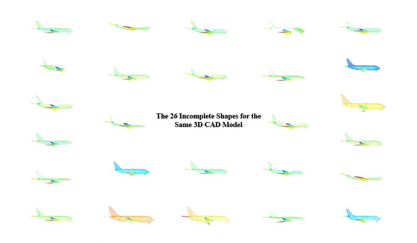

# *MVP Benchmark:* Point Cloud Completioin
<p align="center"> 

</p>


We include the following methods for point cloud completion:

[1] [PCN](https://github.com/wentaoyuan/pcn);&nbsp;&nbsp; [2] [ECG](https://github.com/paul007pl/ECG);&nbsp;&nbsp; [3] [VRCNet](https://github.com/paul007pl/VRCNet)


### MVP Completion Dataset
<!-- Download the MVP completion dataset by the following commands:
```
cd data; sh download_data.sh
``` -->
Download the MVP completion dataset [Google Drive](https://drive.google.com/drive/folders/1XxZ4M_dOB3_OG1J6PnpNvrGTie5X9Vk_) or [百度网盘](https://pan.baidu.com/s/18pli79KSGGsWQ8FPiSW9qg)&nbsp;&nbsp;(code: p364) to the folder "data".

The data structure will be:
```
data
├── MVP_Train_CP.h5
|    ├── incomplete_pcds (62400, 2048, 3)
|    ├── complete_pcds (2400, 2048, 3)
|    └── labels (62400,)
├── MVP_Test_CP.h5
|    ├── incomplete_pcds (41600, 2048, 3)
|    ├── complete_pcds (1600, 2048, 3)
|    └── labels (41600,)
└── MVP_ExtraTest_Shuffled_CP.h5
     ├── incomplete_pcds (59800, 2048, 3)
     └── labels (59800,)
```

| id | 0 | 1 | 2 | 3 | 4 | 5 | 6 | 7 | 8 | 9 | 10 | 11 | 12 | 13 | 14 | 15 |
|:----:|:----:|:----:|:----:|:----:|:----:|:----:|:----:|:----:|:----:|:----:|:----:|:----:|:----:|:----:|:----:|:----:|
| category | airplane | cabinet | car | chair | lamp | sofa | table | watercraft | bed | bench | bookshelf | bus | guitar | motorbike | pistol | skateboard | 
| \#train  | 5200 | 5200 | 5200 | 5200 | 5200 | 5200 | 5200 | 5200 | 2600 | 2600 | 2600 | 2600 | 2600 | 2600 | 2600 | 2600 |
| \#test  | 3900 | 3900 | 3900 | 3900 | 3900 | 3900 | 3900 | 3900 | 1300 | 1300 | 1300 | 1300 | 1300 | 1300 | 1300 | 1300 |


<!-- **Partial point clouds** & **Complete point clouds**

<center class="half">
  <figure>
    
  </figure>
</center> -->

<!-- Partial point clouds | Complete point clouds
:-------------------------:|:---------------- ---------:
 |  -->

### Requirements
+ Four GPUS with a memory greater than 10G. (We only verified the training and prediction with the four GPUs.)
+ The other configs is same like [MVP_Benchmark](https://github.com/paul007pl/MVP_Benchmark.git).
+ The more CPU cores, the better running speed, for using multi-process processing.

### Usage
+ The original data put in `completion/data/.`.
+ Download the pretrained model, unzip in `./log/vrcnet_knn_512_ori/`, e.g. `./log/vrcnet_knn_512_ori/new.pth`.
 - Since the model is small, we compressed the code and the pretrained model together in `log2`. 
 - Simply `mv log2 log` to run the test and train script.
+ `cd completion` into workspace.
+ To train a model: run `bash run_train.sh`. That can be skipped if have pretrained model.
+ To test a model: run `bash run_test.sh`.
+ The results are saved in `./log/vrcnet_knn_512_ori/result.h5`.
+ The submission in `./log/vrcnet_knn_512_ori/submsission_last.zip`.
+ Config about this method can be found in `cfgs/vrcnt_knn.yaml`.
+ The cost of test maybe one or two hours. 

### Method 
We apply data mining techniques like clustering on the original dataset. We propose new problems called (MVPN) the Multi-View Point cloud completion with some Noises like other object partial point clouds. We analyzed VRCNet and made detailed analysis experiments. We improved VRCNet to adapt the MVPN problem. 

## Citation
If any bugs and problems, please contact our by [email](1310135753@qq.com).

## License
Our code is released under Apache-2.0 License.

## Acknowledgement
We include the following algorithms:  
[1] [PCN](https://github.com/wentaoyuan/pcn)    
[2] [ECG](https://github.com/paul007pl/ECG)  
[3] [VRCNet](https://github.com/paul007pl/VRCNet)   

