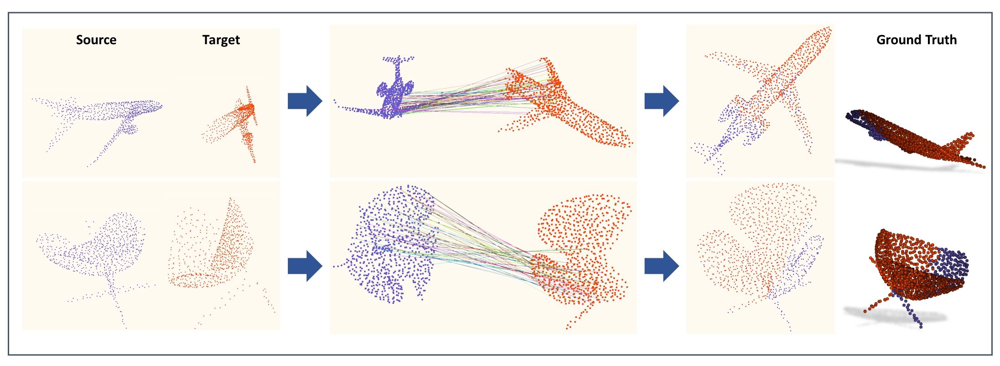

# *MVP Benchmark:* Partial-to-Partial Point Cloud Registration
<p align="center"> 

</p>

### Method
In this task, the positions of the two point cloud data are determined. The rotation matrix and translation vector have a relatively clear mathematical relationship with the position. Therefore, instead of training a model, we use the method of directly optimizing the target parameters, which make us achieve high accuracy in the registration task without the help of supervision information. 

Our innovation is mainly reflected in two aspects: 1. We propose a parameter initialization method. For a single piece of data, we deploy the initial rotation axis as widely as possible in the 3D space. Therefore, our method can accurately find the global optimal value. 2. We propose the corresponding objective function. One difficulty in the registration task is to find the correspondence between the two point cloud data.

### Other Method
We include the following methods for point cloud registration:

[1] [DCP](https://github.com/WangYueFt/dcp);&nbsp;&nbsp; [2] [DeepGMR](https://github.com/wentaoyuan/deepgmr);&nbsp;&nbsp; [3] [IDAM](https://github.com/jiahaowork/idam)


### MVP Registration Dataset
<!-- Download the MVP registration dataset by the following commands:
```
cd data; sh download_data.sh
``` -->
Download the MVP registration dataset [Google Drive](https://drive.google.com/drive/folders/1RlUW0vmmyqxkBTM_ITVguAjxzIS1MFz4) or [百度网盘](https://pan.baidu.com/s/18pli79KSGGsWQ8FPiSW9qg)&nbsp;&nbsp;(code: p364) to the folder "data".

The data structure will be:
```
data
├── MVP_Train_RG.h5
|    ├── src (6400, 2048, 3)
|    ├── tgt (6400, 2048, 3)
|    ├── complete (6400, 2048, 3)
|    ├── cat_label (6400,)
|    ├── match_id (6400,)
|    └── match_level (6400,)
├── MVP_Test_RG.h5
|    ├── rotated_src (1200, 2048, 3)
|    ├── rotated_tgt (1200, 2048, 3)
|    ├── pose_src (1200, 4, 4)
|    ├── pose_tgt (1200, 4, 4)
|    ├── rot_level (1200,)
|    ├── transforms (1200, 4, 4)
|    ├── src (1200, 2048, 3)
|    ├── tgt (1200, 2048, 3)
|    ├── complete (1200, 2048, 3)
|    ├── cat_label (1200,)
|    ├── match_id (1200,)
|    └── match_level (1200,)
└── MVP_ExtraTest_RG.h5
     ├── rotated_src (2000, 2048, 3)
     ├── rotated_tgt (2000, 2048, 3)
     └── cat_label (2000,)
```

We create the registration dataset by ensuring surfficent overlaps between the source point cloud and the target.
Partial point cloud pairs with "match_level = 1" mostly have more correspondences than those with "match_level = 0".

Most relative rotations are within [0, 45\textdegree], and the rest have unrestricted rotations \in [0, 360\textdegree].
The ratio is roughly 4 : 1.

Note that the source and the target are two different incomplete point clouds scanned from the same CAD model.

### Public performance and rank
+ We get the results on public submission: Rot_Error: `2.94973(1)`, Trans_Error: `0.02108(1)`, MSE: `0.07257(1)`
+ If there is a large deviation in the reproduce results, please contact us by [email](1310135753@qq.com).

### Requirements
+ Four GPUS with every memory greater than 10G. (We only verified the optimization process with four gpus.)
+ The other setups is same like [MVP_BenchMark](https://github.com/paul007pl/MVP_Benchmark.git), following `bash setup.sh`.  

### Usage
+ `cd registration` into the workspace.
+ `mkdir log` and `mkdir log/houv` to build the savedir.
+ `touch log/houv/train.log` to build the log file.
+ To test `MVP_ExtraTest_RG.h5` dataset: run `bash run_test.sh`. 
  - This script needs four gpus.
  - It maybe take one or two hours.
  - If run error, please step by step commands in `run_test.sh`.
+ Config for those methods can be found in `cfgs/`.
+ The results are saved in `./log/houv/results.h5`
+ The submission in `submission_last.zip`


+ Please note that the running code is stochastic. 
+ Although we tried our best to avoid unreproducible problems, following this configs in codes.
  ```
      random.seed(seed)
      np.random.seed(seed)
      torch.manual_seed(seed)
      torch.cuda.manual_seed_all(seed)
  ```
+ However, the problem still exists and we have not completely solved it.

+ To test  `MVP_Test_RG.h5` dataset: run `bash run_train.sh`
  - As the dataset is small, this script need one gpu.


## Citation
If any bugs and problems, please contact us by [email](1310135753@qq.com).

## License
Our code is released under Apache-2.0 License.

## Acknowledgement
We include the following algorithms:  
[1] [DCP](https://github.com/WangYueFt/dcp)     
[2] [DeepGMR](https://github.com/wentaoyuan/deepgmr)     
[3] [IDAM](https://github.com/jiahaowork/idam)    
